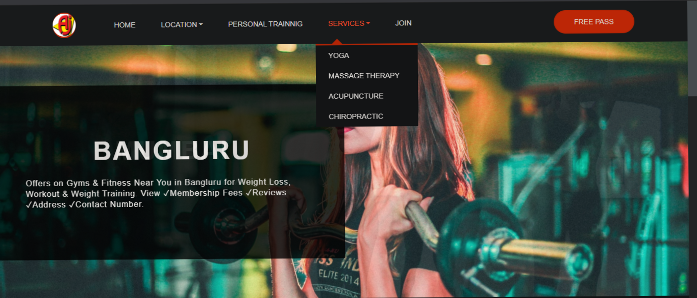

## Anushka GYM Website



# Project Title

Responsive Gym website 

## 1. Demo Website

- 👉 Netlify : https://anushka-gym.netlify.app/


## 2. You Will Learn
```
- HTML5 and CSS3: Semantic Elements, CSS Grid, Flexbox.

- CSS Media Queries, CSS Animations, CSS transition.

- Image Slider, Background Video, Pure CSS 3D Rotating Image Gallery.

- Profile Card, Product Card.

- Dropdown Navigation Bar (CSS & JavaScript).

- Google Map API.
```

## 3. Clone repo

```
$ git@github.com:NileshShriwas/Anushka-GYM.git
$ cd Anushka-GYM
```
## 4. Run 
```
- Run this on chrome: http://192.168.142.77:5500/index.html

- You are use VS Code install Live Server (Extention) and Directly Run.
